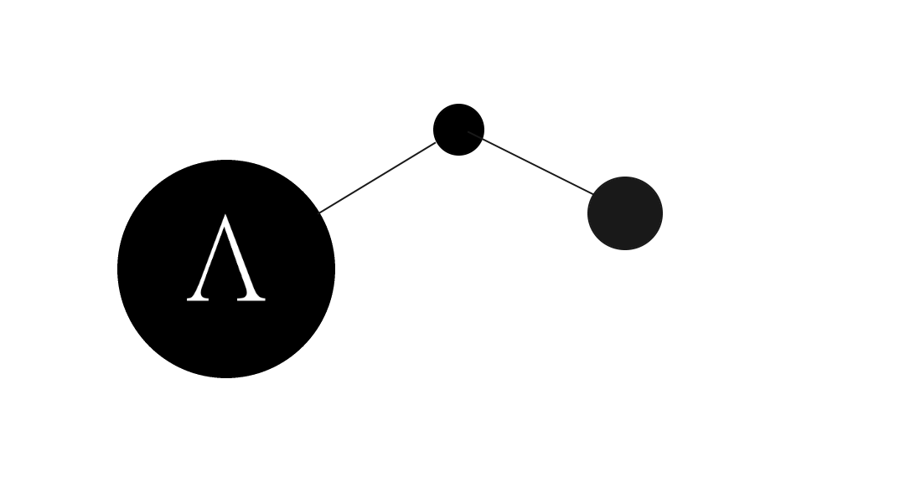

<h1 align="center">
  
   
  Project: 
   
</h1>

  
   
  
  

 

# Learning_Python

## **Introduction:**

This repository has the purpose of keep tracking of my own learning path of python, the technologies used in this project are:

- Python
- Anaconda
- Jupiter

---

## Master lectures:

The master lectures are the technical reference used for the ground of this project

At [platzi](https://platzi.com/)
- [Pyhton Basic](https://platzi.com/clases/pythonbasico/)
  - [Project: "" ](url)
- [Pyhton intermediate](https://platzi.com/clases/pythonbasico/)
  - [Project: "" ](url)
- [Object-oriented programming with python](https://platzi.com/clases/poo-python/)
  - [Project: "" ](url)
- [Dynamic and Stochastic Programming with Python](https://platzi.com/clases/programacion-estocastica/)
  - [Project: "" ](url)

At [FreeCodeCamp](https://www.freecodecamp.org/)

- [Python Tutorials](https://www.youtube.com/playlist?list=PLWKjhJtqVAbnqBxcdjVGgT3uVR10bzTEB)
  - [Project: "" ](url)
  - [Project: "" ](url)
  - [Project: "" ](url)

## Derivations and related of this project:

- [Euler Project](https://github.com/Alejandro-sin/Euler_Project)
- [Data Science](https://github.com/Alejandro-sin/Learning_DataScience)
- [Webscraping](https://github.com/Alejandro-sin/Learning_WebScraping)

■________________________________________________________________ exit() ■

